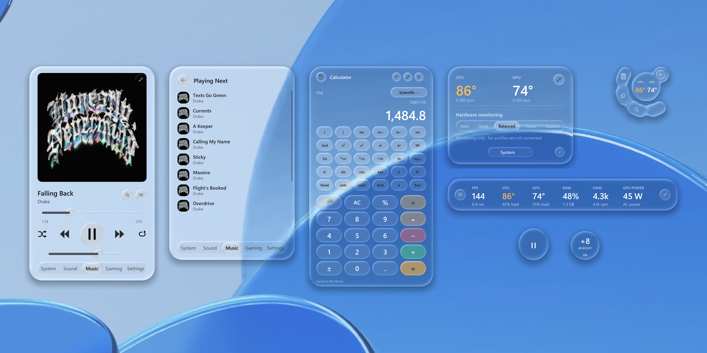
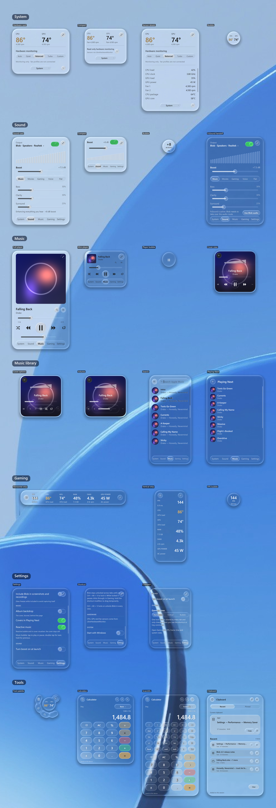

<p align="center">
  
</p>

<h1 align="center">Blob</h1>

<p align="center">
  <b>A floating liquid-glass control panel for Windows</b><br>
  Music controls, PC temperatures, sound enhancement and an in-game FPS counter — in one small, beautiful window.
</p>

<p align="center">
  <a href="https://github.com/GAEONN/Blob/releases/latest"></a>
  
  
  <a href="LICENSE"></a>
</p>

<p align="center">
  
</p>

## What is Blob?

Blob sits on your desktop like a drop of glass. It shows what's playing (Spotify, YouTube, Apple
Music and more) and lets you pause or skip, tells you how hot your CPU and graphics card are, can
make your PC's sound louder and clearer, and shows your frames per second while you play games.
It's free, it doesn't show ads, and it doesn't collect your data.

## Download and install

It takes about 5 minutes. You don't need to know anything about coding.

1. **[Download the installer (Install-Blob.cmd)](https://github.com/GAEONN/Blob/releases/latest/download/Install-Blob.cmd)**
2. Open your **Downloads** folder and **double-click `Install-Blob.cmd`**.
   - If Windows says *"Windows protected your PC"*, click **More info → Run anyway**.
     If your browser asks whether to keep the file, choose **Keep**.
3. A black window shows the progress. When Windows asks *"Do you want to allow this app to make
   changes?"*, click **Yes** — this installs the optional sensor, sound and FPS helpers.

Blob opens by itself when it's done, and a **Blob v5** icon appears on your desktop.
**Restart your PC once** afterwards so the sound and FPS features finish setting up.

<details>
<summary><b>Prefer typing a command?</b> (same result)</summary>

Right-click the **Start** button, choose **Terminal**, paste this line and press **Enter**:

```powershell
irm https://raw.githubusercontent.com/GAEONN/Blob/main/install.ps1 | iex
```

</details>

### What you need

- **Windows 11** (64-bit)
- An internet connection during installation
- That's it — the installer sets up everything else, including Python, automatically.

## How to use it

| To… | Do this |
| --- | --- |
| Show or hide Blob | Click the **Blob icon** near the clock (bottom-right of the taskbar). You may need to click **^** to see it. |
| Switch between the small view and the big Dashboard | Press **F10** while Blob is selected, or right-click the Blob icon → **SmallBlob / Dashboard** |
| Move Blob | Drag it anywhere |
| Let your mouse click *through* Blob (for games) | Press **Left Ctrl + Right Ctrl** together (or **Ctrl + Alt + V**) to lock it; press again to unlock. Blob stays locked, in the same spot, even after a restart |
| Start Blob with Windows | Right-click the Blob icon → **Start with Windows** |
| Close Blob | Right-click the Blob icon → **Exit Blob** |

Each view — **System**, **Sound**, **Music** and **Gaming** — can also shrink into a small bubble.
The [feature guide](#feature-guide) below explains every button.

## Update to the newest version

**[Download Update-Blob.cmd](https://github.com/GAEONN/Blob/releases/latest/download/Update-Blob.cmd)** and double-click it.
It closes Blob, installs the latest version, keeps all your settings, and opens Blob again.

## Uninstall

1. Right-click the Blob icon near the clock → turn off **Start with Windows** → **Exit Blob**.
2. Open File Explorer, paste `%LOCALAPPDATA%\Programs` into the address bar, press Enter, and delete
   the **Blob-v5** folder. Do the same for `%LOCALAPPDATA%` and its **Blob-v5** folder (your settings).
3. Delete the **Blob v5** shortcut from your desktop.

Optional helpers the installer may have added (safe to keep, or remove if you like):
the **Blob Sensors** task in *Task Scheduler*, **PawnIO** in *Settings → Apps*, and the
**VB-CABLE** audio driver (run its setup from [vb-audio.com/Cable](https://vb-audio.com/Cable/) and choose *Remove*).

## Common questions

<details>
<summary><b>Is Blob safe?</b></summary>

Yes. All of Blob's code is public on this page, so anyone can check exactly what it does. It doesn't
send your data anywhere, doesn't inject into games, and doesn't touch anti-cheat. Windows shows a
warning for the installer only because it isn't a paid, signed app.
</details>

<details>
<summary><b>I installed it but I can't see Blob.</b></summary>

Click the small **^** arrow near the clock and click the Blob icon. If there's no icon, double-click
the **Blob v5** shortcut on your desktop.
</details>

<details>
<summary><b>Temperatures or fan speeds say "unavailable".</b></summary>

Some PCs don't share this information with Windows. Restart once after installing so the sensor
helper can start. If it's still missing, your PC's hardware doesn't expose that sensor.
</details>

<details>
<summary><b>The FPS counter shows nothing.</b></summary>

Sign out of Windows and back in once after installing (or restart). Play in **windowed** or
**borderless** mode — true fullscreen games can hide overlays.
</details>

<details>
<summary><b>Sound enhancement doesn't work.</b></summary>

Restart your PC once after installing so the VB-CABLE audio driver finishes setting up, then turn
Sound on in Blob. If you use FxSound, click **Use Blob audio** in Blob's Sound view — the two can't
run at the same time.
</details>

<details>
<summary><b>Blob doesn't appear in my screenshots or recordings.</b></summary>

That's on purpose, so the glass looks right. Turn on **Include Blob in screenshots and recordings**
in Blob's Settings.
</details>

<details>
<summary><b>I found a problem or have an idea.</b></summary>

[Open an issue](https://github.com/GAEONN/Blob/issues/new) and describe what happened — screenshots help a lot.
</details>

## Screenshots

**Every view**, section by section in tab order: System, Sound, Music, Music library, Gaming,
Settings and Tools:



**Gaming strip** — regular, with the view menu open, and compact:


<sub>Screenshots are Blob's real glass rendered at 2× with sample data: *Honestly, Nevermind* by Drake
playing; album artwork belongs to its owners. Desktop photo by
[Muriel Liu](https://unsplash.com/@muriel_1) on [Unsplash](https://unsplash.com/photos/vCp7Q2ACSQg).
Earlier gaming-strip designs are in [docs/screenshots/gaming-layouts](docs/screenshots/gaming-layouts).</sub>

## Feature guide

### What each view does

| View | Purpose |
| --- | --- |
| **Hardware** | CPU/GPU temperatures and utilization, memory, storage, battery, fan RPM, clocks, and power when available |
| **Sound** | System-wide boost, equalization, bass, clarity, stereo width, limiter, and spectrum visualization |
| **Music** | Service-neutral Windows now-playing controls, artwork, timeline, queue tools, and an audio-reactive bubble |
| **Gaming** | Always-on-top FPS, frame time, temperatures, utilization, memory, fan, and GPU-power strip |
| **Settings** | Startup, capture visibility, pointer style, overlay lock shortcut, and per-feature options |

SmallBlob retains Settings → Appearance → Size → Regular / Compact, as well as its System, Sound
and Music bubbles, square album-art view, and Gaming's matching Horizontal / Vertical strips plus
the small FPS/frame-time Bubble. Choose the Gaming state in Settings; Bubble returns to the
last strip orientation through its inset satellite. Dashboard adds the simultaneous overview
and a slim, downward-expanding left game dock.

### Everyday controls

- Click Blob's tray icon to show or hide the interface.
- Drag the normal card or an empty area to pin it anywhere.
- Press `Esc` to dismiss the current expanded Music view, then dismiss Blob.
- Press Left Ctrl + Right Ctrl together, or `Ctrl+Alt+V` (or your migrated shortcut), to lock/unlock SmallBlob or the game dock.
  The shortcut is editable in Settings; the full Dashboard cannot be made click-through.
- Locked mode passes pointer input through Blob on every view.
- Enable **Include Blob in screenshots and recordings** in Settings when capture visibility matters.

SmallBlob keeps its existing tab behavior. The detached game dock starts locked; returning
from Dashboard to SmallBlob's Gaming view also starts locked to protect game input.

### Hardware without an OEM lock-in

Blob is designed for Windows PCs rather than a particular laptop manufacturer. Standard load,
memory, adapter, battery, and storage information comes from Windows. Additional sensor data is
read from whichever supported provider is available.

| Measurement | Source |
| --- | --- |
| CPU/GPU utilization | Windows performance counters |
| Memory, battery, adapters | Windows APIs |
| NVMe temperatures | Windows storage IOCTL |
| CPU/GPU temperatures and fan RPM | LibreHardwareMonitor, OpenHardwareMonitor, or HWiNFO shared memory |
| NVIDIA temperature, clock, and power | NVML when present |

Sensor availability depends on the motherboard, controller, firmware, and provider support. Windows
does not expose a universal temperature or fan-control API. Blob therefore treats its Auto, Quiet,
Balanced, Turbo, and Custom choices as monitoring preferences unless a real hardware backend reports
that it can apply them; it never pretends a firmware fan curve changed.

The System bubble behaves like this:

- The main body shows CPU and GPU temperatures at a glance.
- Click the visible satellite to return to the full System card.
- While Blob is unlocked, click-drag the bubble to reposition it.

### Music that is not tied to Apple Music

Blob reads the active Windows media session, so now-playing information and transport controls work
with Spotify, YouTube, browsers, Apple Music, and other compatible players. Apple Music installation
is optional; when present, Blob can additionally expose its catalog search and Playing Next data.

The Music card includes artwork, metadata, seeking, previous/play/next, volume, and an Options panel.
Its corner circle morphs into a two-lobe player bubble:

- Tap the main lobe to play or pause.
- Double-tap the main lobe to skip to the next track.
- Hold the main lobe to return to the previous track.
- Click the satellite to restore the Music card.
- Click-drag the satellite to move the bubble.

The equalizer-bars button in Music Options toggles **Reactive music bubble**. When enabled, Blob uses
the routed 28-band spectrum when available; otherwise it watches every active Windows playback
endpoint and derives level/transient motion. Bass expands the body, mids flex the fused neck, and
treble moves the satellite. This works without enabling Blob's Sound enhancement.

### Sound

Sound is optional. When enabled, Windows audio is routed through VB-CABLE into Blob's separate DSP
process and then played on the selected physical output. The processing chain provides EQ, bass,
clarity, stereo width, loudness compression, and a look-ahead limiter. Blob accepts the installed
VB-CABLE endpoint-name variants and can use FxSound's configured physical destination after the
user chooses **Use Blob audio** to hand off the route.

Running DSP outside the interface keeps rendering stalls away from the audio stream. If VB-CABLE is
missing, the Sound view reports the missing setup instead of silently failing. FxSound and Blob
cannot own the Windows default route at the same time; the handoff button closes FxSound, starts
Blob's route, and restores the prior device when Blob is disabled.
Regular and Compact Sound cards also offer a small status bubble showing boost and on/off state;
its satellite restores the full Sound controls.

### Gaming overlay

Gaming is a narrow, no-activation overlay intended for windowed and borderless games. SmallBlob
offers the same six-metric strip in horizontal or vertical orientation, plus a Bubble that only
shows FPS and frame time. It displays real application presentation intervals from PresentMon
rather than monitor refresh rate.

- Unlock Blob to navigate or reposition the strip.
- Lock Blob before playing so clicks pass through it.
- Locked is completely locked: nothing can drag it, and it keeps its spot through restarts and
  resolution changes. Unlock it to move it.
- Use windowed or borderless fullscreen; ordinary desktop overlays cannot guarantee visibility over
  exclusive fullscreen applications.

Blob does not inject into games, alter anti-cheat, or change a game's display settings. Missing or
stale frame data is shown as unavailable rather than replaced with an invented value.

### Screenshots and recordings

Blob normally excludes itself from Windows capture so it can refract the live desktop without
feeding its previous frame back into the glass. Enable **Include Blob in screenshots and recordings**
to make it visible to capture tools. In that mode, the backdrop freezes while Blob is visible to
avoid recursive self-capture.

## For developers

Blob is written in Python with OpenGL and native Win32 APIs — no browser window and no Electron.
SmallBlob and the Dashboard are two views of one app: they share one window, tray icon, audio
engine, media session, sensor monitor and settings. See [docs/V5-NOTES.md](docs/V5-NOTES.md).

### Alternative installation

Clone the repository and run the installer locally:

```powershell
git clone --branch main https://github.com/GAEONN/Blob.git
cd Blob
powershell -ExecutionPolicy Bypass -File .\install.ps1
```

Or double-click `Install Blob.cmd` from an extracted checkout. Optional switches are available for
deliberately partial setups:

```powershell
powershell -ExecutionPolicy Bypass -File .\install.ps1 `
  -SkipAudio -SkipSensors -SkipPresentMon -NoLaunch
```

For a local checkout, the update-capable command is:

```powershell
powershell -ExecutionPolicy Bypass -File .\install.ps1 -Update
```

To start an installed checkout manually, use `Launch Blob.cmd`, the desktop shortcut, or:

```powershell
.\.venv\Scripts\pythonw.exe .\app.pyw
```

### Technical requirements

- Windows 11
- A GPU and driver supporting OpenGL 3.3
- Python 3.10–3.13; the installer can provision Python through WinGet
- Administrator approval only for the optional drivers, sensor provider, and FPS permission setup

### Development

Install the Python dependencies into a virtual environment, then launch `app.pyw`. Run the offline
regression suite with:

```powershell
python -m unittest discover -s tests -v
python -m unittest discover -s dashboard -p test_dashboard.py -v
```

Render the real GPU glass against a synthetic desktop for visual inspection:

```powershell
python tests/render_preview.py --output preview.png
# the README gallery, over the same desktop photo:
python tests/render_preview.py --background docs/screenshots/backdrop.jpg --output preview.png
python tests/render_preview.py --showcase --background docs/screenshots/backdrop.jpg --output showcase.png
python tests/render_preview.py --gallery --background docs/screenshots/backdrop.jpg --output gallery.jpg
python tests/render_preview.py --gaming --scale 2 --background docs/screenshots/backdrop.jpg --output gaming.png
# add --cover <image> to use your own album artwork in --showcase / --gallery / --album renders
```

Key files:

| File | Responsibility |
| --- | --- |
| [`unified.py`](unified.py) | Single-instance host, shared controllers, view switching, v5 settings |
| [`dashboard/dashboard.py`](dashboard/dashboard.py) | Full overview and downward-expanding gaming dock |
| [`blob.pyw`](blob.pyw) | Window lifecycle, layout, animation, input, and view behavior |
| [`glass.py`](glass.py) | Desktop capture, signed-distance shader, refraction, and layered-window output |
| [`engine.py`](engine.py) | Vendor-neutral Windows monitoring and optional sensor providers |
| [`sound.py`](sound.py) | Audio-device management, routing, levels, and UI-facing sound state |
| [`audio_engine.py`](audio_engine.py) | Isolated real-time DSP process |
| [`media.py`](media.py) | Windows media sessions and transport commands |
| [`applemusic.py`](applemusic.py) | Optional Apple Music search, queue, and playback integration |
| [`DESIGN.md`](DESIGN.md) | Visual system, shader model, interaction rules, and spring behavior |
| [`PRODUCT.md`](PRODUCT.md) | Product behavior and feature contract |
| [`docs/`](docs) | Release notes for v3–v5, screenshots, and the original build brief |

### Current limitations

- Detailed sensors are only as complete as the PC firmware and selected sensor provider allow.
- Cross-vendor fan monitoring is practical; universal fan control is not. Safe control requires a
  supported controller-specific backend.
- FPS capture may require a sign-out after installation before the new Windows group membership is
  present in the login token.
- Exclusive-fullscreen games can appear above normal desktop overlays.
- Apple Music-specific search and queue features depend on the installed app and its UI availability;
  normal media controls do not.

## Older versions

Every earlier version is kept on the [Releases](https://github.com/GAEONN/Blob/releases) page and as
[tags](https://github.com/GAEONN/Blob/tags): **v3.0.0**, **v3.1.0**, **v4.0.0**, **v5.0.0**, plus the archived
`archive-before-yao` and `archive-v4-merged-refraction` snapshots.

## License

Free and open source under the [MIT license](LICENSE).
