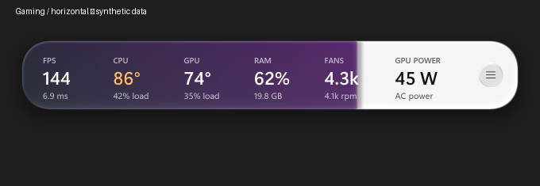
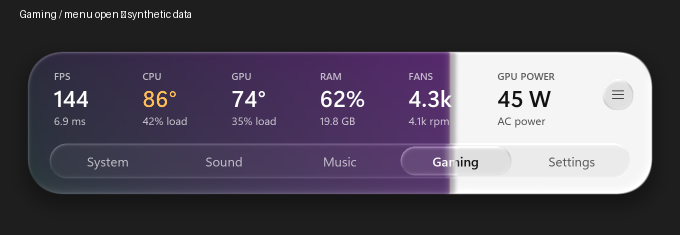
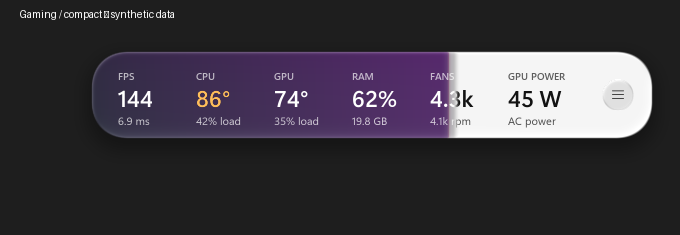
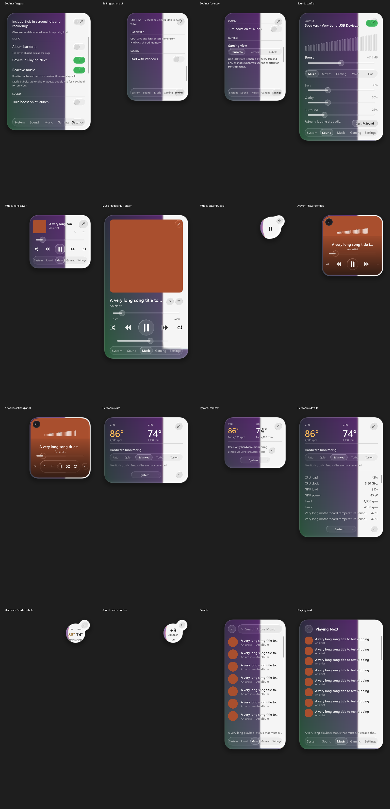
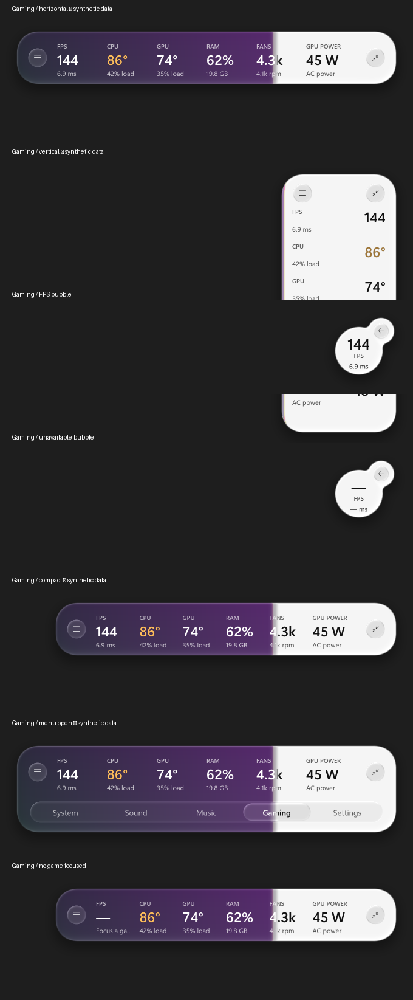

# Blob v5 — SmallBlob + Dashboard

One application, two presentations: the SmallBlob layouts and the large
Dashboard showing Music, System, Sound and Gaming together. They share one window, tray,
audio controller, media session, sensor monitor and settings profile. Switching does not
restart playback or create another DSP engine. See [V5-NOTES.md](V5-NOTES.md).

Right-click the tray icon → **SmallBlob / Dashboard / Game dock**, or press **F10 while
Blob is focused** to switch between small and full views. F11 resizes Dashboard only.
The Dashboard top rail also opens SmallBlob directly and includes a native minimize control.
The game dock expands downward and starts click-through. The shared default lock shortcut
is **Ctrl+Alt+V**, or your migrated shortcut. Do not run older enhancers alongside v5.

Blob v5 is the current application on `main`. Historical **v3.0.0**, **v4.0.1**, and the
initial **v5.0.0** release tag remain available for rollback.

Blob is a small, GPU-rendered control surface for Windows. It floats above the desktop as real-time
liquid glass and brings hardware monitoring, system audio, media controls, and an in-game performance
strip into one interface.

It is built with Python, OpenGL, and native Win32 APIs—no browser window and no Electron runtime.

## Gallery

Offline renders of the v5 layouts (sample data, drawn with `tests/render_preview.py`).

**Gaming strip** — regular, with the view menu open, and compact:





**Music, System, Sound and Settings** — cards, bubbles and the moving album backdrop:



**Bubble states** — the gaming strip docked beside MiniBlob's bubbles:



Earlier gaming-strip layout studies are in [docs/screenshots/gaming-layouts](docs/screenshots/gaming-layouts).

## Install

Open **PowerShell** and run:

```powershell
irm https://raw.githubusercontent.com/GAEONN/Blob/main/install.ps1 | iex
```

The installer downloads the current `main` source to `%LOCALAPPDATA%\Programs\Blob-v5`, creates an
isolated Python environment, installs the required packages, prepares optional integrations,
creates a desktop shortcut, verifies the installation, and launches the app. It preserves the
separate `%LOCALAPPDATA%\Blob-v5` preferences folder.
Preferences live in `%LOCALAPPDATA%\Blob-v5`; first launch copies the latest legacy preferences without
editing the original and leaves audio boost off. Re-running repairs this v5 installation.

One administrator prompt may be required for optional system integrations:

- **LibreHardwareMonitor + PawnIO** for broader temperature and fan-sensor coverage.
- **PresentMon** and Performance Log Users membership for real FPS/frame-time capture.
- **VB-CABLE** for Blob's optional system-wide sound processing.

After a fresh full installation, sign out and back in once for FPS permission changes. Restart
Windows once if the VB-CABLE driver was installed. Blob itself, media controls, and the standard
Windows metrics remain usable while optional integrations are unavailable.

> Review [`install.ps1`](install.ps1) before running the one-line installer if you prefer to inspect
> remote scripts before execution.

## Update

To update an existing installation to the latest GitHub `main` build, run this in PowerShell:

```powershell
irm https://raw.githubusercontent.com/GAEONN/Blob/main/update.ps1 | iex
```

The updater downloads the current installer, closes only the running Blob process, preserves your
preferences and optional components, refreshes the application files and dependencies, recreates
the shortcut, verifies the result, and launches Blob again. To update without launching it:

```powershell
& ([scriptblock]::Create((irm https://raw.githubusercontent.com/GAEONN/Blob/main/update.ps1))) -NoLaunch
```

If you downloaded the repository as a ZIP, run `Install Blob.cmd` once, or use
`powershell -ExecutionPolicy Bypass -File .\install.ps1`. Re-running the installer is safe and
repairs the same installation.

## What Blob includes

| View | Purpose |
| --- | --- |
| **Hardware** | CPU/GPU temperatures and utilization, memory, storage, battery, fan RPM, clocks, and power when available |
| **Sound** | System-wide boost, equalization, bass, clarity, stereo width, limiter, and spectrum visualization |
| **Music** | Service-neutral Windows now-playing controls, artwork, timeline, queue tools, and an audio-reactive bubble |
| **Gaming** | Always-on-top FPS, frame time, temperatures, utilization, memory, fan, and GPU-power strip |
| **Settings** | Startup, capture visibility, pointer style, overlay lock shortcut, and per-feature options |

SmallBlob retains Settings → Appearance → Size → Regular / Compact, as well as its System, Sound
and Music bubbles, square album-art view, and Gaming's matching Horizontal / Vertical strips plus
the small FPS/frame-time Bubble. Choose the Gaming state in Settings; Bubble returns to the
last strip orientation through its inset satellite. Dashboard adds the simultaneous overview
and a slim, downward-expanding left game dock.

## Everyday controls

- Click Blob's tray icon to show or hide the interface.
- Drag the normal card or an empty area to pin it anywhere.
- Press `Esc` to dismiss the current expanded Music view, then dismiss Blob.
- Press `Ctrl+Alt+V` (or your migrated shortcut) to lock/unlock SmallBlob or the game dock.
  The shortcut is editable in Settings; the full Dashboard cannot be made click-through.
- Locked mode passes pointer input through Blob on every view.
- Enable **Include Blob in screenshots and recordings** in Settings when capture visibility matters.

SmallBlob keeps its existing tab behavior. The detached game dock starts locked; returning
from Dashboard to SmallBlob's Gaming view also starts locked to protect game input.

## Hardware without an OEM lock-in

Blob is designed for Windows PCs rather than a particular laptop manufacturer. Standard load,
memory, adapter, battery, and storage information comes from Windows. Additional sensor data is
read from whichever supported provider is available.

| Measurement | Source |
| --- | --- |
| CPU/GPU utilization | Windows performance counters |
| Memory, battery, adapters | Windows APIs |
| NVMe temperatures | Windows storage IOCTL |
| CPU/GPU temperatures and fan RPM | LibreHardwareMonitor, OpenHardwareMonitor, or HWiNFO shared memory |
| NVIDIA temperature, clock, and power | NVML when present |

Sensor availability depends on the motherboard, controller, firmware, and provider support. Windows
does not expose a universal temperature or fan-control API. Blob therefore treats its Auto, Quiet,
Balanced, Turbo, and Custom choices as monitoring preferences unless a real hardware backend reports
that it can apply them; it never pretends a firmware fan curve changed.

The System bubble behaves like this:

- The main body shows CPU and GPU temperatures at a glance.
- Click the visible satellite to return to the full System card.
- While Blob is unlocked, click-drag the bubble to reposition it.

## Music that is not tied to Apple Music

Blob reads the active Windows media session, so now-playing information and transport controls work
with Spotify, YouTube, browsers, Apple Music, and other compatible players. Apple Music installation
is optional; when present, Blob can additionally expose its catalog search and Playing Next data.

The Music card includes artwork, metadata, seeking, previous/play/next, volume, and an Options panel.
Its corner circle morphs into a two-lobe player bubble:

- Tap the main lobe to play or pause.
- Double-tap the main lobe to skip to the next track.
- Hold the main lobe to return to the previous track.
- Click the satellite to restore the Music card.
- Click-drag the satellite to move the bubble.

The equalizer-bars button in Music Options toggles **Reactive music bubble**. When enabled, Blob uses
the routed 28-band spectrum when available; otherwise it watches every active Windows playback
endpoint and derives level/transient motion. Bass expands the body, mids flex the fused neck, and
treble moves the satellite. This works without enabling Blob's Sound enhancement.

## Sound

Sound is optional. When enabled, Windows audio is routed through VB-CABLE into Blob's separate DSP
process and then played on the selected physical output. The processing chain provides EQ, bass,
clarity, stereo width, loudness compression, and a look-ahead limiter. Blob accepts the installed
VB-CABLE endpoint-name variants and can use FxSound's configured physical destination after the
user chooses **Use Blob audio** to hand off the route.

Running DSP outside the interface keeps rendering stalls away from the audio stream. If VB-CABLE is
missing, the Sound view reports the missing setup instead of silently failing. FxSound and Blob
cannot own the Windows default route at the same time; the handoff button closes FxSound, starts
Blob's route, and restores the prior device when Blob is disabled.
Regular and Compact Sound cards also offer a small status bubble showing boost and on/off state;
its satellite restores the full Sound controls.

## Gaming overlay

Gaming is a narrow, no-activation overlay intended for windowed and borderless games. SmallBlob
offers the same six-metric strip in horizontal or vertical orientation, plus a Bubble that only
shows FPS and frame time. It displays real application presentation intervals from PresentMon
rather than monitor refresh rate.

- Unlock Blob to navigate or reposition the strip.
- Lock Blob before playing so clicks pass through it.
- While locked in Gaming, hold the shortcut modifiers to drag temporarily without changing the lock.
- Use windowed or borderless fullscreen; ordinary desktop overlays cannot guarantee visibility over
  exclusive fullscreen applications.

Blob does not inject into games, alter anti-cheat, or change a game's display settings. Missing or
stale frame data is shown as unavailable rather than replaced with an invented value.

## Screenshots and recordings

Blob normally excludes itself from Windows capture so it can refract the live desktop without
feeding its previous frame back into the glass. Enable **Include Blob in screenshots and recordings**
to make it visible to capture tools. In that mode, the backdrop freezes while Blob is visible to
avoid recursive self-capture.

## Alternative installation

Clone the repository and run the installer locally:

```powershell
git clone --branch main https://github.com/GAEONN/Blob.git
cd Blob
powershell -ExecutionPolicy Bypass -File .\install.ps1
```

Or double-click `Install Blob.cmd` from an extracted checkout. Optional switches are available for
deliberately partial setups:

```powershell
powershell -ExecutionPolicy Bypass -File .\install.ps1 `
  -SkipAudio -SkipSensors -SkipPresentMon -NoLaunch
```

For a local checkout, the update-capable command is:

```powershell
powershell -ExecutionPolicy Bypass -File .\install.ps1 -Update
```

To start an installed checkout manually, use `Launch Blob.cmd`, the desktop shortcut, or:

```powershell
.\.venv\Scripts\pythonw.exe .\app.pyw
```

## Requirements

- Windows 11
- A GPU and driver supporting OpenGL 3.3
- Python 3.10–3.13; the installer can provision Python through WinGet
- Administrator approval only for the optional drivers, sensor provider, and FPS permission setup

## Development

Install the Python dependencies into a virtual environment, then launch `app.pyw`. Run the offline
regression suite with:

```powershell
python -m unittest discover -s tests -v
python -m unittest discover -s dashboard -p test_dashboard.py -v
```

Render the real GPU glass against a synthetic desktop for visual inspection:

```powershell
python tests/render_preview.py --output preview.png
```

Key files:

| File | Responsibility |
| --- | --- |
| [`unified.py`](unified.py) | Single-instance host, shared controllers, view switching, v5 settings |
| [`dashboard/dashboard.py`](dashboard/dashboard.py) | Full overview and downward-expanding gaming dock |
| [`blob.pyw`](blob.pyw) | Window lifecycle, layout, animation, input, and view behavior |
| [`glass.py`](glass.py) | Desktop capture, signed-distance shader, refraction, and layered-window output |
| [`engine.py`](engine.py) | Vendor-neutral Windows monitoring and optional sensor providers |
| [`sound.py`](sound.py) | Audio-device management, routing, levels, and UI-facing sound state |
| [`audio_engine.py`](audio_engine.py) | Isolated real-time DSP process |
| [`media.py`](media.py) | Windows media sessions and transport commands |
| [`applemusic.py`](applemusic.py) | Optional Apple Music search, queue, and playback integration |
| [`DESIGN.md`](DESIGN.md) | Visual system, shader model, interaction rules, and spring behavior |
| [`PRODUCT.md`](PRODUCT.md) | Product behavior and feature contract |

## Current limitations

- Detailed sensors are only as complete as the PC firmware and selected sensor provider allow.
- Cross-vendor fan monitoring is practical; universal fan control is not. Safe control requires a
  supported controller-specific backend.
- FPS capture may require a sign-out after installation before the new Windows group membership is
  present in the login token.
- Exclusive-fullscreen games can appear above normal desktop overlays.
- Apple Music-specific search and queue features depend on the installed app and its UI availability;
  normal media controls do not.

## License

[MIT](LICENSE)
